### What is it?

* This course is an introduction to programming fundamentals, and also lets SE 
  freshmen get their feet wet early with object-oriented programming (OOP),
  which is the most popular paradigm.

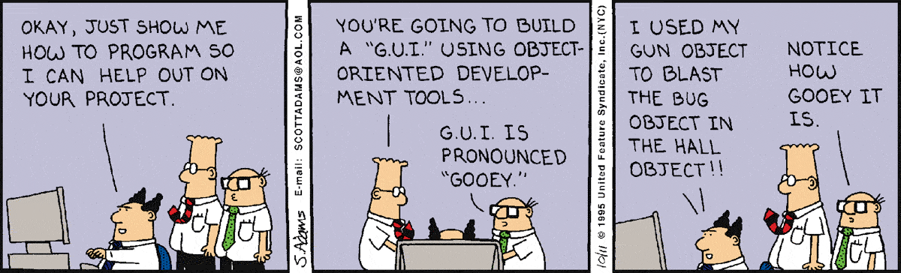

### What's programming?

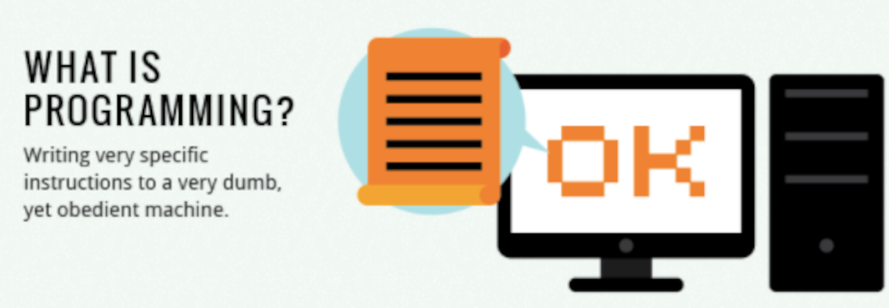

- Instructions written in a language dumb computers can easily
  decipher: a **_programming language_**

### Too many programming langauges

* try going to https://www.tiobe.com/tiobe-index/
* some are not beginner-friendly

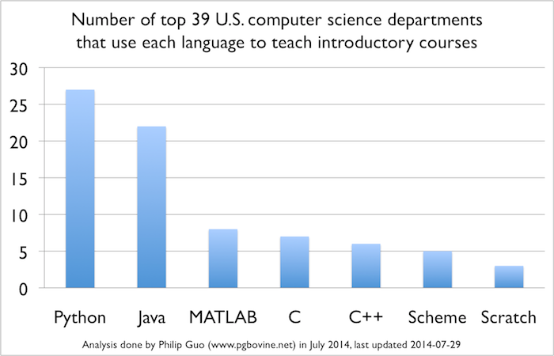 <!-- .element: style="width: 600px; height: 400px" -->

### CPU SE chooses...

* a langauge from TIOBE's top 10
* used by [Stanford](https://www.stanforddaily.com/2017/02/28/cs-department-updates-introductory-courses/)
  in its [CS101](https://web.stanford.edu/class/cs101/syllabus.html)
* let's you do almost anything 😉

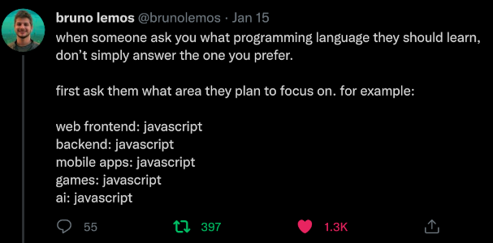

### What we'll learn? (1/7)

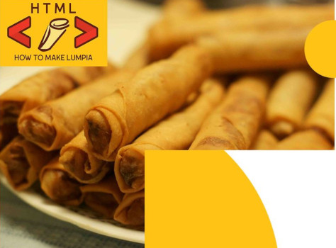

Javasript can run on your browser, so let's learn how to make simple, ugly web
pages first

### What we'll learn? (2/7)

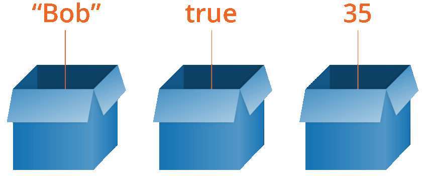

Excited? We won't write programs yet, but learn some of their building blocks:
variables and data types

### What you'll learn? (3/7)

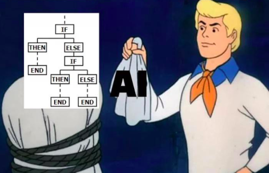

Conditionals: Teach computers how to do things only under certain conditions.

### What you'll learn? (4/7)

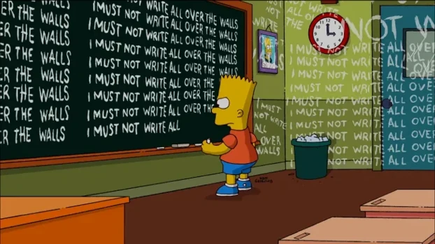

Loops: Teach computers how to do things again and again and again.

### What you'll learn? (5/7)

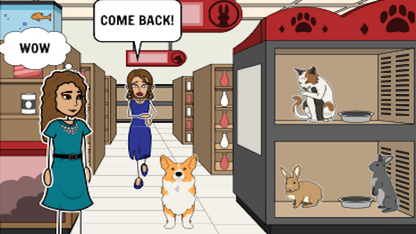

Organize your program into objects:  Fancy a petshop game?  A petshop's objects
would be:  pets, veterinarians, shelves, customers, pet food, etc.

### What you'll learn? (6/7)

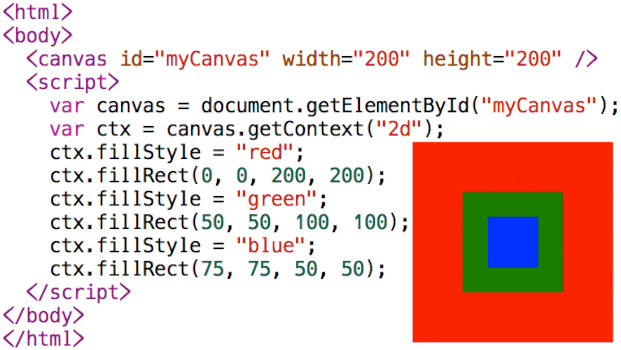

Learn how to draw 2D graphics on an HTML Canvas.

### What you'll learn? (7/7)

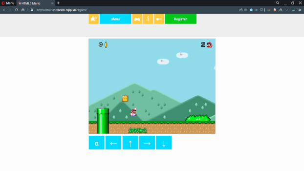

Build a game from scratch using everything you learned above.

### Pre-requisites

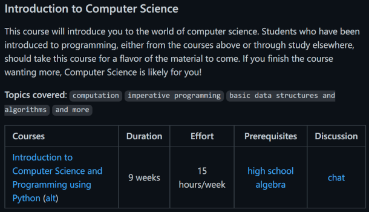

Officially, it says **none** on your prospectus, but many coding tasks require
some _algebra on steroids_

### Which courses need SE 1121 as a prereq?

* all of your first year second sem courses
  - SE 1222 co-requires SE 1223, which pre-requires SE 1121
* Failing this course would mean a 1 year delay
  - CPU policy:  can't take multiple lab subjects in _"summer"_
    + while you can take SE 1121 in second term if you **request** it
    + you **can't** take both SE 1222 and SE 1223 in one summer

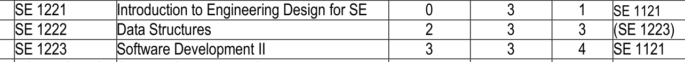