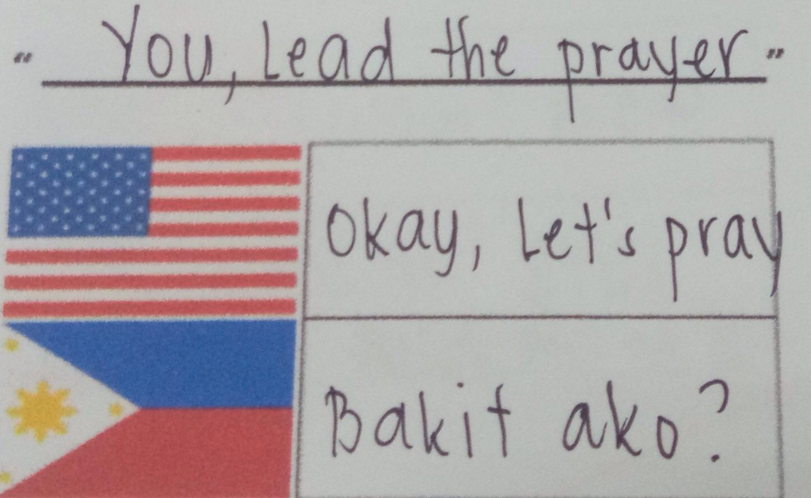
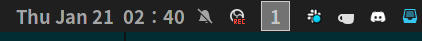
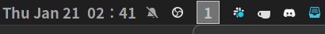
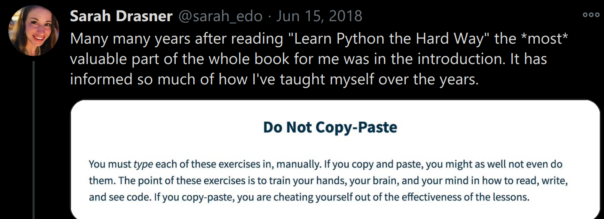
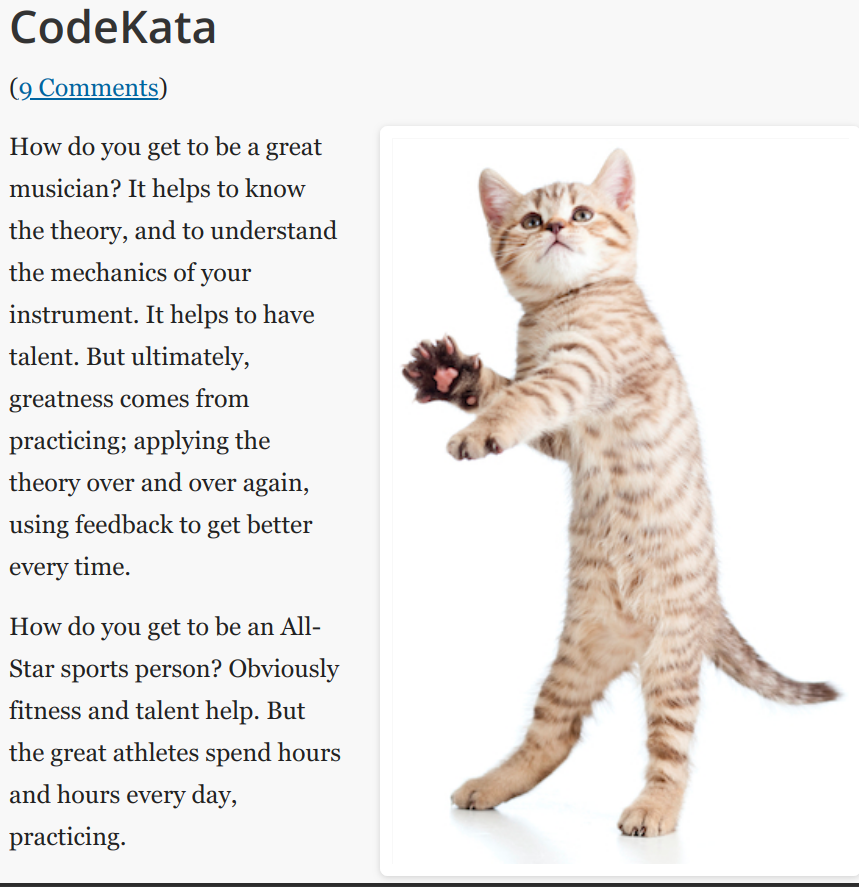
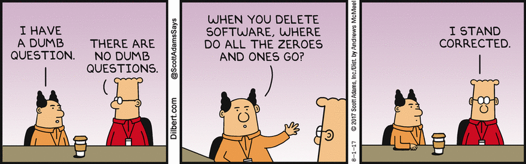
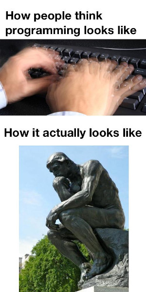
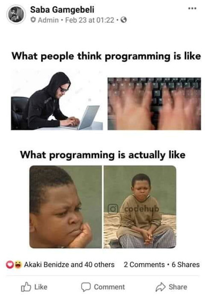
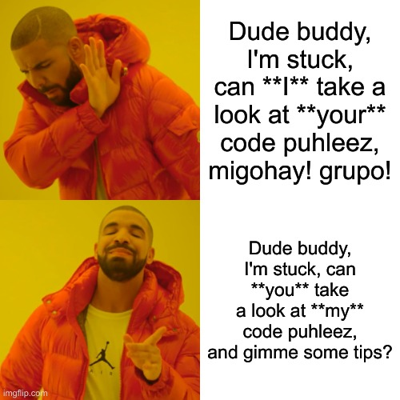

# House Rules

### Prayer

##### Let's start our live classes with a prayer

 <!-- .element style="width: 800px; height: 500px" -->

#### I won't pinpoint a student to lead the prayer

* Student don't refuse, but may not have the 💖
* When I enter the live class session, if the Holy Spirit moves you to pray, go ahead

> As she kept on praying to the Lord, Eli observed her mouth.
> Hannah was **praying in her heart**, and her lips were moving but her voice was not heard.  
\-1 Samuel 1:12-13

### Pray from the heart, doesn't have to be English

> 7 When you pray, don’t babble on and on as the Gentiles do. 
> They think their prayers are answered merely by repeating their words again and again.
> 9 Pray like this:
> 
> Our Father in heaven....  
\-Matthew 6:7,9

##### Live Class House Rules (1/2)

+ 🔇 Mute your mic when not speaking

 <!-- .element style="width: 650px; height: 450px" -->

##### Live Class House Rules (2/2)

+ call my attention if lecture is not recorded
  - recording  
    \
  - not recording  
    
+ English is the medium of instruction
  - **PRACTICE:** most software companies are multi-national  
     

### LEARN THE HARD WAY

+ try not to open past exercises when practicing
  - or if you need to, just don't copy and paste lazily

### PRACTICE, PRACTICE, PRACTICE

  
  <ul>
    <li><b>Do</b> the problem sets</li>
    <li>Even if they are a <b>LOT</b></li>
    <li>This sem we'll try
      <ul>
        <li>50% basics - solve these for a 3.0 equivalent</li>
        <li>25% average - solve 👆 and these for a 2.0 equivalent</li>
        <li>25% difficult - solve 👆 and these for a 1.0 equivalent</li>
      </ul>
    </li>
  </ul>

### GO THE EXTRA MILE

+ fast learners will have lots of extra time
  - don't be idle and waste time
  - learn beyond what's required
    + make sure you **100%** understand what you learn in advance

#### Jesus taught us to go the extra mile

ASK QUESTIONS
=============

* There are no stupid questions, **don't be shy**.
  - FUN FACT:  Students that ask lots of questions have an 80% chance to get **1.0**.

ACADEMIC INTEGRITY
==================

**Absolutely no to cheating in my classes**

> Whoever can be trusted with very little can also be trusted with much, and whoever is dishonest with very little will also be dishonest with much.  
\-Luke 16:10

> Whoever walks in integrity walks securely,
> but whoever takes crooked paths will be found out.  
\-Proverbs 10:9

##### Coding is thinking, not copying <!-- .element style="font-size: 0.65em" -->

|  |  |
|----------------------------|-----------------------------|

#### If you don't get caught
* it will still backfire, one day when working, you'll have no one to copy from
  - remember Prov 10:9, you **will** be found out
* only ~8% of PH grads can pass Stacktrek's exam for applicants
  - they graduated but can't pass a **basic** coding exam?
* but there's Google!
  - a bank in our country got hacked, for copying, **without understanding** -- StackOverflow code
    snippets that is neither meant to be complete nor secure, but just illustrates an idea

#### If you're stuck with a problem set for more than 45 minutes

#### If you're stuck with a quiz or exam for more than 45 minutes

Treat *new normal* quizzes and exams as **proctored**