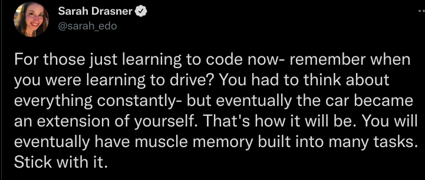
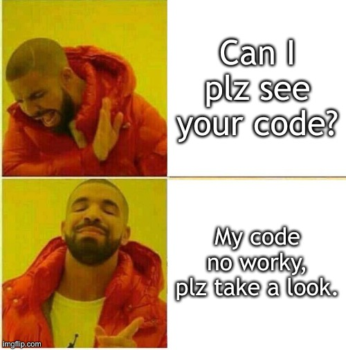

# Do's and Don'ts

### Do: Pray before our live classes

### Do: Pray before our live classes

 <!-- .element style="width: 800px; height: 500px" -->

#### I won't pinpoint a student to lead the prayer

* When I enter the live class session and request someone to pray, just volunteer
  through the leading of the Holy Spirit
  - volunteering usually leads to prayers that are **sincere**

> As she kept on praying to the Lord, Eli observed her mouth.
> Hannah was **praying in her heart**, and her lips were moving but her voice was not heard.  
\-1 Samuel 1:12-13

### Do:Pray from the heart, doesn't have to be English

> 7 When you pray, don’t babble on and on as the Gentiles do. 
> They think their prayers are answered merely by repeating their words again and again.
> 9 Pray like this:
> 
> Our Father in heaven....  
\-Matthew 6:7,9

##### Live Class House Rules (1/2)

+ 🔇 Do: Mute your mic when not speaking

 <!-- .element style="width: 650px; height: 450px" -->

##### Live Class House Rules (2/2)

+ Do: remind me to record our live classes
  - for the sake of those with Internet or brownout problems
  - absent: (e.g. sick, quarantined in facility, emergency, etc.)
+ Do: remind me to resume recording if ever I pause (e.g. seatwork, CR break)

  

### Do: communicate in English

+ English is the medium of instruction
  - Some of your classmates are foreign students
  - **PRACTICE:** most software companies are multi-national  
     
  - it doesn't had to be perfect grammer, other countries more progressive
    but there English are not wery goot.
  - always strive to recite, chat, ask questions, or help someone else in English 
    (live class, Discord)

### Do: LEARN THE HARD WAY

+ try not to open past exercises when practicing
  - or if you need to, just don't copy and paste lazily

### Do:  PRACTICE, PRACTICE, PRACTICE

  
  <ul>
    <li><b>Do</b> the problem sets</li>
    <li>Even if they are a <b>LOT</b></li>
    <li>Usual breakdown:
      <ul>
        <li>50% basics - solve these for a 3.0 equivalent</li>
        <li>25% average - solve 👆 and these for a 2.0 equivalent</li>
        <li>25% difficult - solve 👆 and these for a 1.0 equivalent</li>
      </ul>
    </li>
  </ul>

### Do: GO THE EXTRA MILE

+ fast learners will have lots of extra time
  - don't be idle and waste time
  - learn beyond what's required
    + make sure you **100%** understand what you learn in advance

#### Jesus taught us to go the extra mile

Do:  ASK QUESTIONS
=============

* There are no stupid questions, **don't be shy**.
  - FUN FACT:  Students that ask lots of questions have an 80% chance to get **1.0**.

### Don't:  Give Up

* Some of you are beginners <!-- .element style="font-size: 0.9em" -->
  - or forgot your JHS coding lessons
  - beginners struggling is super OK.

ACADEMIC INTEGRITY
==================

**Don't: cheat**

> Whoever can be trusted with very little can also be trusted with much, and whoever is dishonest with very little will also be dishonest with much.  
\-Luke 16:10

> Whoever walks in integrity walks securely,
> but whoever takes crooked paths will be found out.  
\-Proverbs 10:9

##### Coding is thinking, not copying <!-- .element style="font-size: 0.65em" -->

|  |  |
|----------------------------|-----------------------------|

#### If you don't get caught
* it will still backfire, one day when working, you'll have no one to copy from
  - remember Prov 10:9, you **will** be found out
* only ~8% of PH grads can pass Stacktrek's exam
  - they graduated but can't pass a **basic** coding exam?
* but there's Google!
  - a bank in our country got hacked, for copying, **without understanding** -- StackOverflow code
    snippets that is neither meant to be complete nor secure, but just illustrates an idea

#### If you're stuck, show your code to get help

#### If you're stuck on a quiz or exam

Treat *new normal* quizzes and exams as **proctored**

### Do: love your course

One SE batch has a favorite quote:

> For the love of SE! 💓💓💓

- When there's love, there's pain 😉
  - [Language reflects culture](https://medium.com/@lucas.po/our-peoples-tongue-the-history-and-future-of-the-hokkien-language-in-the-philippines-414e0628932f). 
    In the Min Nan (a.k.a. Hokkien) dialect  spoken by most Chinoys, love and
    pain are both the same words: 疼 (tian)
